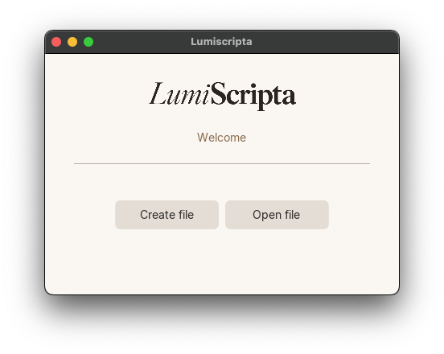
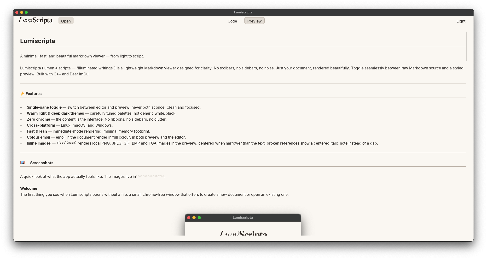
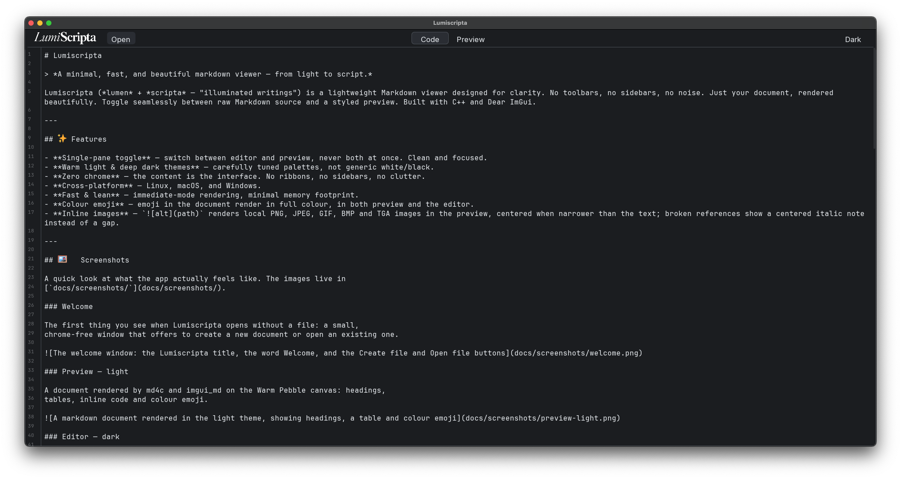

# Lumiscripta

> *A minimal, fast, and beautiful markdown viewer — from light to script.*

Lumiscripta (*lumen* + *scripta* — "illuminated writings") is a lightweight Markdown viewer designed for clarity. No toolbars, no sidebars, no noise. Just your document, rendered beautifully. Toggle seamlessly between raw Markdown source and a styled preview. Built with C++ and Dear ImGui.

---

## ✨ Features

- **Single-pane toggle** — switch between editor and preview, never both at once. Clean and focused.
- **Warm light & deep dark themes** — carefully tuned palettes, not generic white/black.
- **Zero chrome** — the content is the interface. No ribbons, no sidebars, no clutter.
- **Cross-platform** — Linux, macOS, and Windows.
- **Fast & lean** — immediate-mode rendering, minimal memory footprint.
- **Colour emoji** — emoji in the document render in full colour, in both preview and the editor.
- **Inline images** — `` renders local PNG, JPEG, GIF, BMP and TGA images in the preview; relative paths resolve against the markdown file's own directory.

---

## 🖼️ Screenshots

A quick look at what the app actually feels like. The images live in
[`docs/screenshots/`](docs/screenshots/).

### Welcome

The first thing you see when Lumiscripta opens without a file: a small,
chrome-free window that offers to create a new document or open an existing one.



### Preview — light

A document rendered by md4c and imgui_md on the Warm Pebble canvas: headings,
tables, inline code and colour emoji.



### Editor — dark

The same document in Code mode on the Slate Almond palette: monospaced source,
a hairline line-number gutter and a blinking caret.



---

## 📦 Dependencies

All third-party code is included in this repository under `third_party/`:


| Library | Purpose | License |
|---|---|---|
| [Dear ImGui](https://github.com/ocornut/imgui) | Immediate-mode GUI | MIT |
| [Hello ImGui](https://github.com/pthom/hello_imgui) | Cross-platform bootstrap | MIT |
| [imgui_md](https://github.com/mekhontsev/imgui_md) | Markdown rendering | MIT |
| [md4c](https://github.com/mity/md4c) | Markdown parser | MIT |
| [ImGuiColorTextEdit](https://github.com/BalazsJako/ImGuiColorTextEdit) | Syntax-highlighted editor | MIT |
| [stb_image](https://github.com/nothings/stb) | Image decoding for the preview | Public domain / MIT |

Emoji glyphs are provided by [Twemoji Mozilla](https://github.com/mozilla/twemoji-colr)
(COLRv0), rasterized with [FreeType](https://freetype.org/) via ImGui's
`misc/freetype` back-end. See `assets/fonts/TwemojiMozilla.LICENSE.txt`.

The two **system dependencies** you need to install are **GLFW** (window and input
handling) and **FreeType** (colour emoji rasterization).

### Linux
```bash
# Ubuntu / Debian
sudo apt install libglfw3-dev libglew-dev libfreetype6-dev

# Fedora / RHEL
sudo dnf install glfw-devel glew-devel freetype-devel

# Arch
sudo pacman -S glfw glew freetype2
```

### macOS
```bash
# MacPorts
sudo port install glfw freetype

# Homebrew
brew install glfw glew freetype
```

### Windows
Download GLFW binaries from [glfw.org](https://www.glfw.org/download.html) or install via vcpkg:
```bash
vcpkg install glfw3 glew freetype
```

---

## 🚀 Quick Start

No CMake. Just `make`.

```bash
git clone https://github.com/yourusername/lumiscripta.git
cd lumiscripta
make -j$(nproc)
```

The Makefile auto-detects your platform (Linux, macOS, Windows/MinGW) and links the correct libraries.

```bash
# Run
make run
# or
./lumiscripta
```

---

## 🎹 Controls

| Action | Shortcut |
|---|---|
| Open file | `Ctrl/Cmd + O` |
| Toggle editor / preview | `Ctrl/Cmd + E` |
| Toggle light / dark theme | `Ctrl/Cmd + Shift + T` |
| Increase font size | `Ctrl/Cmd + +` |
| Decrease font size | `Ctrl/Cmd + -` |
| Paste from clipboard | `Ctrl/Cmd + V` |

---

## 🏗️ Architecture

```
lumiscripta/
├── include/lumiscripta/    # Public headers
│   ├── App.h
│   ├── File.h
│   ├── Graphics.h
│   └── Helpers.h
├── src/                     # Implementation
│   ├── main.cpp
│   ├── App.cpp
│   ├── File.cpp
│   └── Graphics.cpp
├── third_party/             # External dependencies
│   ├── hello_imgui/         # (git submodule)
│   ├── imgui_md/
│   ├── md4c/
│   └── ImGuiColorTextEdit/
├── assets/                  # Fonts, icons
└── Makefile
```

---

## 📝 License

Lumiscripta is released under the [MIT License](LICENSE).

---

## 🙏 Acknowledgements

Built with gratitude for the incredible Dear ImGui ecosystem and the open-source community that makes projects like this possible.