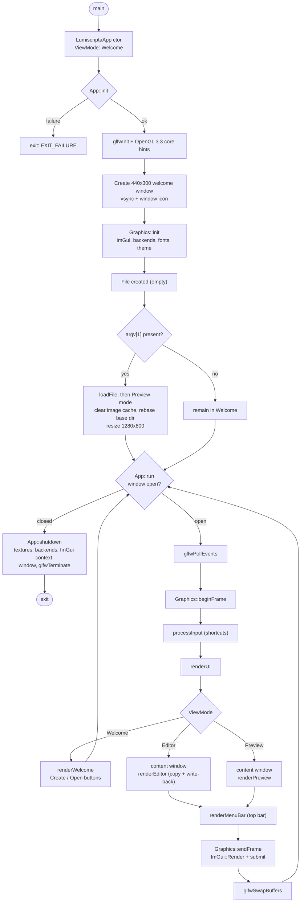

# Application Flow

The lifecycle of a Lumiscripta process, from `main()` to `glfwTerminate()`. Source of truth: [`src/main.cpp`](../../src/main.cpp) and [`src/app.cpp`](../../src/app.cpp).

## Startup

`main()` constructs a `LumiscriptaApp` (initial state: `ViewMode::Welcome`, no window yet), then:

1. `App::init()` — on failure, print to `std::cerr` and exit `EXIT_FAILURE`.
2. If `argv[1]` is present, `App::loadFile(argv[1])` — a failure only warns; the app still starts.
3. `App::run()` — blocks until the window closes.
4. `App::shutdown()`.

## Initialization (`App::init`)

1. `glfwInit()`; window hints for an OpenGL **3.3 core** profile (plus `GLFW_OPENGL_FORWARD_COMPAT` on macOS).
2. Create the **small welcome window: 440×300**, titled `Lumiscripta`; make the context current; `glfwSwapInterval(1)` (VSync).
3. Window/taskbar icon: `stbi_load()` on `resolveAsset("branding/logo-light.png")` → `glfwSetWindowIcon()` → free the pixels. A missing icon is explicitly non-fatal.
4. `Graphics::init(window)`: ImGui context, GLFW + OpenGL3 backends (GLSL `#version 330`), font-atlas construction (see [font-system.md](font-system.md)), branding wordmark paths, initial light theme. Failure aborts startup.
5. Create the `File` object (empty).

## Optional CLI Load

`loadFile(path)`: `File::load()` reads the whole file synchronously; on success App calls `Graphics::clearImageCache()` and `setBaseDirectory(parentDirectory(path))` (so relative images resolve against the document), then `enterMainUI(ViewMode::Preview)` — which switches mode **and resizes the window to 1280×800**, leaving the welcome screen behind for good.

## Main Loop (`App::run`)

While `m_running && !glfwWindowShouldClose(m_window)`:

1. `glfwPollEvents()`
2. `Graphics::beginFrame()` — `ImGui_ImplOpenGL3_NewFrame()` → `ImGui_ImplGlfw_NewFrame()` → `ImGui::NewFrame()`
3. `processInput()` — global shortcuts (below)
4. `renderUI()` — view-mode dispatch (below)
5. `Graphics::endFrame()` — `ImGui::Render()` → `ImGui_ImplOpenGL3_RenderDrawData(ImGui::GetDrawData())`
6. `glfwSwapBuffers(m_window)`

The window closing is the only exit path (`m_running` is never cleared).

## Input Handling (`processInput`)

`ctrlOrCmd = io.KeyCtrl || io.KeySuper`, so shortcuts use Ctrl on Windows/Linux and Cmd on macOS:

| Shortcut | Action |
|---|---|
| Ctrl/Cmd + O | Native open dialog (`chooseFilePath()`); loads the selection |
| Ctrl/Cmd + E | `toggleView()` — Preview ↔ Editor (ignored on the welcome screen) |
| Ctrl/Cmd + Shift + T | `toggleTheme()` — Light ↔ Dark |
| Ctrl/Cmd + `=` / keypad `+` | `FontGlobalScale += 0.1`, clamped to 2.5 |
| Ctrl/Cmd + `-` / keypad `-` | `FontGlobalScale -= 0.1`, clamped to 0.5 |
| Ctrl/Cmd + S | Save — only to the *existing* path (there is no save-as dialog) |

`chooseFilePath()` uses `popen()` to run a per-platform picker — macOS `osascript`, Windows PowerShell `OpenFileDialog`, Linux `zenity` else `kdialog` — and returns the path printed on stdout (empty string = cancelled or unavailable).

## View-Mode Dispatch (`renderUI`)

- **`Welcome`**: `renderWelcome()` fills the viewport with a chrome-free window — theme-aware wordmark (text fallback), "Welcome", and two buttons. *Create file* creates an empty `File` and calls `enterMainUI(Editor)`; *Open file* runs the picker and `loadFile()` (→ Preview). It returns early — **no top bar in Welcome mode**.
- **`Editor` / `Preview`**: a borderless content window is placed below the 40 px top bar:
  - *Preview*: `Graphics::renderPreview(m_file->getContent())`.
  - *Editor*: the buffer is **copied** into a local `string`, passed to `Graphics::renderEditor(editable)`, then written back with `File::setContent()`.
  - Finally `renderMenuBar()` draws the top bar: theme-aware wordmark (text fallback), *Open* button, centered Code/Preview segmented toggle, and a right-aligned Light/Dark button. It reserves its 40 px height with a trailing `ImGui::Dummy` so `WorkPos`/`WorkSize` remain stable for the content window next frame.

`toggleView()` flips Preview ↔ Editor (or enters the Editor from the welcome screen); `toggleTheme()` asks `Graphics` for the current theme and applies the opposite one.

## Shutdown (`App::shutdown`)

In order: `Graphics::shutdown()` — which deletes cached textures **while the GL context is still alive**, then shuts down the OpenGL3 and GLFW backends and destroys the ImGui context — then `glfwDestroyWindow()` and `glfwTerminate()`.

## Lifecycle Diagram

## Related Documents

- [Overview](overview.md) · [Rendering pipeline](rendering-pipeline.md) · [Class diagram](class-diagram.md)
- [Documentation index](../README.md)