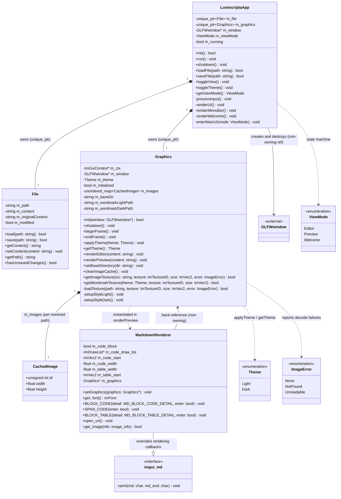

# Class Diagram

Principal components of Lumiscripta, derived from the headers in [`include/lumiscripta/`](../../include/lumiscripta/). Only load-bearing members and public methods are shown; private helpers are omitted for readability.

## Notes on the Diagram

- **`LumiscriptaApp` is the composition root.** It is the only class that owns heap objects (`unique_ptr`) and the only one that touches GLFW window creation/destruction. `File` and `Graphics` never reference each other; App mediates (e.g. `loadFile()` tells `Graphics` to clear its image cache and re-base relative image paths).
- **`MarkdownRenderer` is declared in `graphics.h` but instantiated as a function-local `static` inside `Graphics::renderPreview()`.** `imgui_md` never tells the renderer who owns it, so `setGraphics(this)` is the hook that lets `get_image()` reach the texture cache. The `Graphics*` it holds is a non-owning back-reference.
- **`CachedImage` is a private nested struct of `Graphics`** (shown standalone only for readability); in the header it is `std::unordered_map<string, CachedImage>` keyed by resolved path. It stores the GL texture name as `unsigned int` so the public header does not need OpenGL headers.
- **Font handles are globals, not members:** `g_font_regular`, `g_font_bold`, `g_font_bold_large`, `g_font_mono`, `g_font_mono_large` are `extern ImFont*` declared in `graphics.h`, defined in `graphics.cpp`; a file-local `g_font_italic` serves image error messages. They are shared by the editor, preview, and welcome screen.
- **`File` is intentionally dumb** — a buffer, a path, and a last-saved snapshot. Path logic (image base directories, asset lookup) lives in `App`/`Graphics`/`Utils`.
- Error signaling everywhere is `bool` (no exceptions); enums encode *why* an operation failed where callers need to distinguish causes (`ImageError`).
- Signatures are abridged: `renderEditor` takes `string&` (in-place editing) and `renderPreview` takes `const string&`; pointer/out parameters are shown without `*` where noted by type name (`ImTextureID`, `ImageError`).

## Related Documents

- [Overview](overview.md) · [Application flow](application-flow.md) · [Rendering pipeline](rendering-pipeline.md) · [Decisions](decisions.md)
- [Documentation index](../README.md)