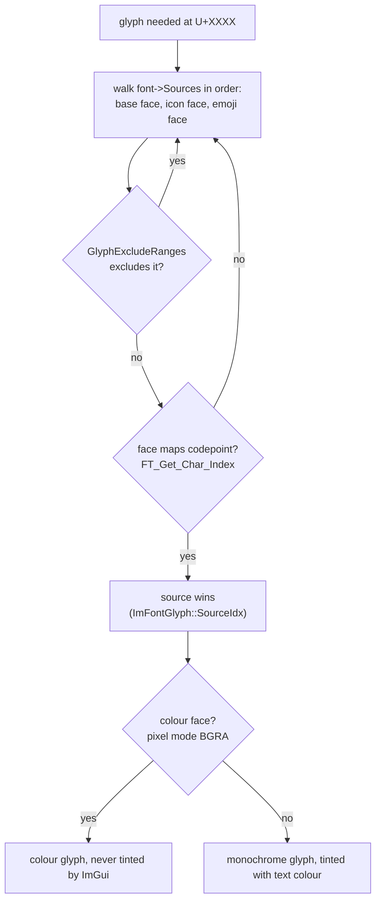

# Font System

All fonts are loaded once, before the first frame, in `Graphics::init()` ([`src/graphics.cpp`](../../src/graphics.cpp)). Paths come from `resolveAsset()` in `utils.h` (executable-relative, never cwd-relative). Missing assets degrade to ImGui's default font; nothing in this system is fatal to the app.

## Inventory

| Handle | Face | Size | Used for |
|---|---|---|---|
| `g_font_regular` | Inter-Regular | 17 px | Body text, UI labels |
| `g_font_bold` | Inter-Bold | 17 px | Headings (non-level-1), strong, table headers |
| `g_font_bold_large` | Inter-Bold | 28 px | Level-1 headings, welcome title |
| `g_font_mono` | JetBrains Mono | 14 px | Code spans/blocks; line numbers (drawn at 0.72×) |
| `g_font_mono_large` | JetBrains Mono | 17.5 px | Editor text |
| `g_font_italic` | Inter-Regular + FreeType oblique | 17 px | Image error notes (file-local `static`) |

The first five are global `ImFont*` (`extern` in `graphics.h`, defined in `graphics.cpp`) and are shared by the editor, preview, and chrome. There is **no Italic cut** of Inter in `assets/fonts/` — the pseudo-italic is `ImGuiFreeTypeLoaderFlags_Oblique` applied to the regular outline.

Two supplementary sources are **merged** into these base faces at init: Font Awesome 7 (icons, regular font only) and Twemoji Mozilla (colour emoji, every text font).

## The Merge Model (why this is fragile)

ImGui has **no cross-font fallback**: a glyph the current font cannot draw simply doesn't appear. Glyph resolution walks the merged sources of the font in use *in order* and takes the **first** source that is not excluded and whose face maps the codepoint:

Consequences encoded in `Graphics::init()`:

- **`GlyphRanges` does not gate resolution** on ImGui's lazy-bake path — only `GlyphExcludeRanges` does. Passing the icon range as `GlyphRanges` does *not* stop the icon face from answering other codepoints.
- **Exclusion lists are terminated by a zero *first* value** (`for (; exclude_list[0] != 0; exclude_list += 2)`), so every list here starts at `0x0001`; a range beginning at `0x0000` would silently disable the whole list.
- **`DstFont` must be set explicitly** on each merge config; the default merges into `Fonts.back()` — whichever font was added last, which is not necessarily the intended target.

## Font Awesome (`kIconExcludeRanges`)

Merged **into `g_font_regular` only**, confined to its private-use block by excluding `0x0001..ICON_MIN_FA-1` and `ICON_MAX_FA+1..0x10FFFF`. This confinement is load-bearing: Font Awesome 7 is not a pure PUA font — `fa-solid-900.otf` also maps ~440 *real* Unicode codepoints as monochrome aliases (ASCII letters and digits, currency signs, arrows, and much of the emoji plane: 📦 📝 🔥 😀 …). Because the icon source is merged *before* the emoji source, an unexcluded icon face would win those lookups and render emoji black-and-white. The emoji face is merged last into each text font, so order plus exclusions together decide ownership.

## Colour Emoji (Twemoji Mozilla)

- Asset: `assets/fonts/TwemojiMozilla.ttf` (Twemoji Mozilla 0.7.0, **COLRv0**; license in `assets/fonts/TwemojiMozilla.LICENSE.txt`).
- Merged into **all five** text fonts — ImGui has no cross-font fallback, so a font without its own emoji merge simply cannot draw emoji (headings and fenced code would lose them otherwise).
- Loader flags: `ImGuiFreeTypeLoaderFlags_LoadColor | ImGuiFreeTypeLoaderFlags_Bitmap` (`kEmojiLoaderFlags`). `LoadColor` alone is **not enough**: imgui_freetype sets `FT_LOAD_NO_BITMAP` unless the `Bitmap` flag is present, which would skip the embedded colour bitmaps and return only a monochrome outline. `Bitmap` additionally lets CBDT (bitmap) colour fonts work and is harmless for COLR fonts.
- `kEmojiExcludeAscii` (`0x0001..0x00FF`) keeps ASCII with the base faces — emoji fonts map some ASCII codepoints for keycap sequences.
- `kEmojiRanges` (arrows, misc technical, dingbats, `2B00–2BFF`, `1F000–1FAFF`) documents intent and seeds preloading; with ImGui's lazy glyph baking, actual ownership is decided by the exclusion lists plus face coverage.

## Why FreeType — and Why Only COLRv0

- ImGui's built-in stb_truetype rasterizer is greyscale-only: a colour emoji font loaded through it renders blank or `?` boxes. Colour emoji therefore require ImGui's **FreeType** back-end (`third_party/imgui/misc/freetype/`, compiled into the binary).
- FreeType rasterizes **`COLR` v0** layer tables (`FT_LOAD_COLOR`) and CBDT/CBLC bitmap fonts (only at their fixed strike size — unusable for text). It has **no rendering support for `COLR` v1** (as of FreeType 2.14) and none for `SVG` tables (which would need `IMGUI_ENABLE_FREETYPE_PLUTOSVG`/`_LUNASVG`). Current Noto Color Emoji builds are COLRv1/SVG and render blank; the default system `NotoColorEmoji.ttf` is a single-strike CBDT font, also unusable. **Any replacement emoji font must be verified COLRv0 first.**
- Colour glyphs make ImGui select an RGBA font atlas (`TexPixelsUseColors`); the OpenGL3 backend uploads it unchanged — no back-end modification needed.
- ImGui never tints colour glyphs (`glyph->Colored` is set when the FreeType pixel mode is BGRA). A monochrome result therefore means a *greyscale source* won the lookup — the text color is never the cause. `ImFontGlyph::SourceIdx` names the winning source when diagnosing.

## Build Defines (ODR-critical)

The Makefile puts `-DIMGUI_ENABLE_FREETYPE -DIMGUI_USE_WCHAR32` into the **global** `CXXFLAGS` so every translation unit that includes `imgui.h` (ImGui's own files, the FreeType loader, and ours) sees identical defines — otherwise `ImWchar`/font-loader layouts differ between units (ODR violation → crashes/UB). `IMGUI_USE_WCHAR32` is required because emoji live above the BMP (U+1F300+); with 16-bit `ImWchar` those codepoints cannot be addressed at all. **Never remove either define** — emoji would silently disappear.

## Safe Loading and Fallback

- `looksLikeFontFile()` checks the first four bytes (TrueType `00 01 00 00`, `OTTO`, `ttcf`, `true`, `typ1`): a truncated download or renamed text file is treated exactly like a missing font, because ImGui would otherwise `assert()` (a real abort under `-O2`).
- `loadFontFile()` additionally sets `ImFontFlags_NoLoadError` so ImGui's error reporting never aborts; the app checks return values itself.
- Fallback chain in `init()`: if the regular face is missing, everything falls back to `AddFontDefault()` (bold/mono handles alias the regular one), and a `std::cerr` message prints the searched asset directories. Missing icon/emoji fonts produce warnings (the emoji warning mentions the COLRv0 constraint) but never stop startup.

## Known, Intentional Leftovers

- Codepoints the **base faces themselves** map stay monochrome with them: Inter maps ~99 and JetBrains Mono ~168 codepoints inside the emoji ranges (arrows, ★, ✓, ❤, ① …) — they intentionally render in the text font's style.
- The **icon range** has a latent collision: Inter maps ~745 private-use codepoints (internal alternates) and JetBrains Mono maps the Powerline block `U+E0A0–U+E0B3`, so an `ICON_FA_*` landing there would draw the base font's glyph instead. No code in `src/` or `include/` draws an icon today (the FontAwesome header is included but no `ICON_FA_*` macro is used), so this is currently unreachable.

## Load-Bearing Checklist

Do not casually change any of these — each fails *silently*:

1. `DstFont` set explicitly on **every** merge config.
2. Every `GlyphExcludeRanges` list starts at `0x0001` (a leading `0x0000` disables the whole list) and `kIconExcludeRanges` confines Font Awesome to its PUA block.
3. Emoji merged into **every** font that renders document text, emoji merge **last**.
4. `LoadColor | Bitmap` together on the emoji source.
5. `-DIMGUI_ENABLE_FREETYPE -DIMGUI_USE_WCHAR32` identical across all translation units.
6. The shipped emoji font stays COLRv0 (Twemoji Mozilla).
7. Fonts are built in a single pass at startup (`Fonts->Build()`); a newly added font needs its own emoji merge in the same block.

## Related Documents

- [Rendering pipeline](rendering-pipeline.md) (font selection per element) · [Overview](overview.md) · [Decisions](decisions.md)
- [Documentation index](../README.md)