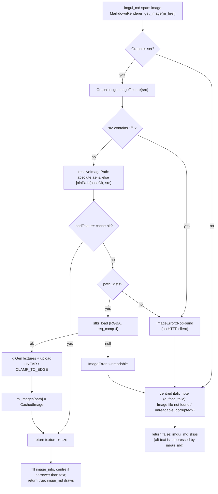

# Image Pipeline

How `` references in a Markdown document become textures in the preview — and how failures are reported. Implementation: `Graphics::getImageTexture()`, `Graphics::loadTexture()`, and `MarkdownRenderer::get_image()` in [`src/graphics.cpp`](../../src/graphics.cpp). The branding wordmark shares the same decode/upload/cache machinery.

## Principles

- **Local files only.** A reference containing `://` (e.g. `http://…`) is rejected up front as `ImageError::NotFound` — the app has no HTTP client, and a viewer must never
  block the UI thread on the network (stated in the code).
- **Caching is mandatory, not an optimization.** `imgui_md` calls `get_image()` every
  frame for every image; the cache (keyed by *resolved path*) guarantees at most one
  decode/upload per path per cache generation.
- **Degrade, never crash.** Missing and broken files produce a visible, centered
  message; nothing throws or aborts.

## Resolution

`App::loadFile()` calls `setBaseDirectory(parentDirectory(path))` on the same frame it
clears the cache, so relative paths always resolve against the **document's directory**.

- Absolute paths (`/…` on POSIX, `X:` drive letter on Windows) are used as-is.
- Relative paths are `joinPath(m_baseDir, src)`; an empty base dir leaves `src` untouched.
- Remote `…://…` references never reach path handling (rejected above).

## Decode and Upload (`loadTexture`)

Exactly one translation unit defines the stb implementation — `graphics.cpp`
(`#define STB_IMAGE_IMPLEMENTATION`); `app.cpp` includes the declarations only, for the
window icon.

1. **Cache lookup** on the resolved path → hit returns the stored texture id and size.
2. **Existence check** (`pathExists`) *before* decoding, so "not there" and "there but
   undecodable" stay distinguishable (`ImageError::NotFound` vs `::Unreadable`).
3. **`stbi_load(..., req_comp = 4)`** — always RGBA: ImGui uploads four components, and
   a grayscale PNG or palette GIF would otherwise arrive with the wrong stride.
   `nullptr` → `Unreadable`.
4. **Upload**: `glGenTextures` → min/mag filter `GL_LINEAR` → wrap
   `GL_CLAMP_TO_EDGE` (with an `#ifndef` fallback constant for the Windows SDK's GL 1.1
   headers) → `glTexImage2D(GL_RGBA)`. The CPU buffer is freed with `stbi_image_free()`
   immediately — the upload has already copied it.
5. Store `CachedImage { id, width, height }` in `m_images` and hand the texture back as
   `ImTextureID` **through an `intptr_t` cast** (never a direct cast: `GLuint` is
   32-bit, `ImTextureID` is pointer-sized).

## Pipeline Diagram

## Rendering and Failure Behavior (`MarkdownRenderer::get_image`)

- **Success**: `image_info` is filled *completely* — texture, size, `uv0 = (0,0)`,
  `uv1 = (1,1)`, white tint, transparent border (imgui_md reads a partially filled
  struct uninitialized). The image is then **centered**: if
  `(available width − size × FontGlobalScale) > 0`, the cursor is shifted by the
  remainder; wider images keep imgui_md's clamp-to-width behavior untouched.
- **Failure**: `imgui_md` suppresses alt text while rendering an image, so `get_image()`
  is the only place a broken reference becomes visible. It draws **one of two centered
  italic messages** in the theme's disabled color (through the FreeType-obliqued
  `g_font_italic`):
  - `Image file not found` — nothing exists at the resolved path (`ImageError::NotFound`,
    including remote references),
  - `Image file is unreadable (corrupted?)` — a file exists but `stbi_load` refused it
    (`ImageError::Unreadable`).

  then returns `false`, and imgui_md skips the image. A null `Graphics*` back-pointer
  also returns `false` without a message.

## Cache Lifecycle

- `clearImageCache()` runs on **every `App::loadFile()`** (textures of the previous
  document must not linger on the GPU) and in **`Graphics::shutdown()`**. Both happen
  while the GL context is still alive — deleting textures after context destruction
  would be a use-after-free against the driver.
- The deletion loop is guarded by `m_initialized`; the map is cleared unconditionally.

## Branding Wordmarks

`getWordmarkTexture(theme)` is the one caller outside the document flow: it picks
`m_wordmarkLightPath` / `m_wordmarkDarkPath` (resolved once at init via
`resolveAsset("branding/wordmark-*.png")`, **never** joined to the document directory)
and passes them through the same `loadTexture()` cache, without surfacing an
`ImageError` (the caller treats `false` as "draw the text fallback").

## Related Documents

- [Rendering pipeline](rendering-pipeline.md) (where `get_image()` is invoked) ·
  [Font system](font-system.md) (the oblique error font) · [Decisions](decisions.md)
  (local-only images, caching)
- [Documentation index](../README.md)