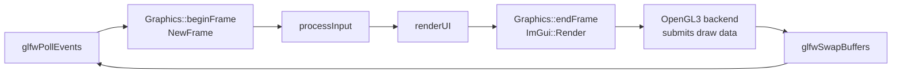
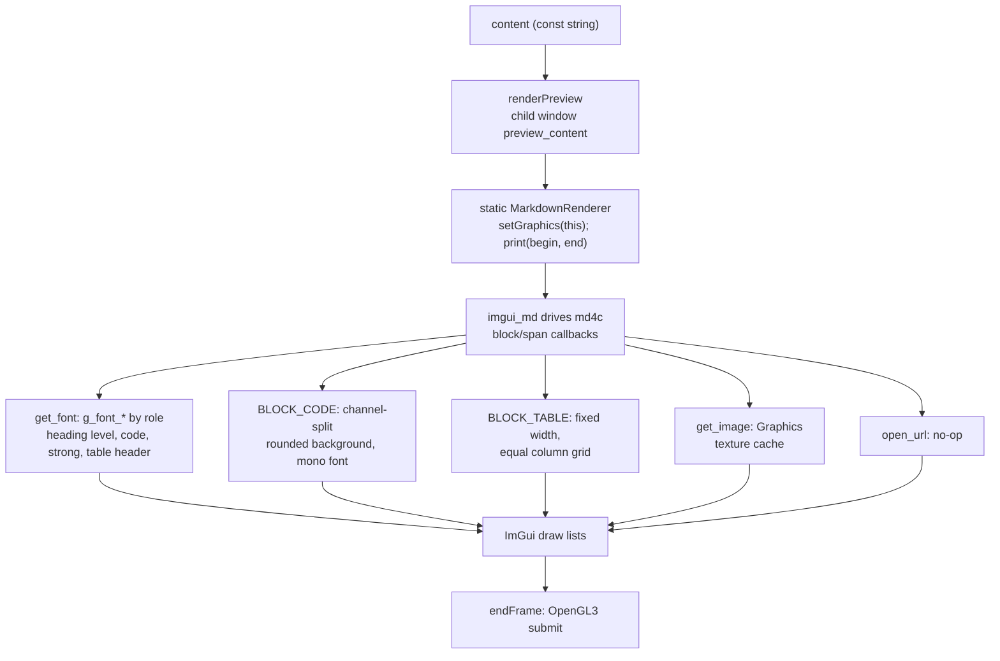

# Rendering Pipeline

How Lumiscripta turns application state and Markdown content into pixels. This document covers the frame model, the editor path, and the preview path; images and fonts have dedicated documents ([image-pipeline.md](image-pipeline.md), [font-system.md](font-system.md)).

## Frame Model

The UI is immediate-mode: everything is rebuilt each frame inside `App::run()`.

`beginFrame()` = `ImGui_ImplOpenGL3_NewFrame()` → `ImGui_ImplGlfw_NewFrame()` →
`ImGui::NewFrame()`. `endFrame()` = `ImGui::Render()` →
`ImGui_ImplOpenGL3_RenderDrawData(ImGui::GetDrawData())`.

## Window Layout

- **Welcome mode**: a single full-viewport window, no top bar (see [application-flow.md](application-flow.md)).
- **Editor / Preview modes**: two windows per frame:
  1. **Content** — placed at `WorkPos + 40 px`, sized `WorkSize − 40 px`, undecorated. Padding is `(0,0)` in Editor (the editor manages its own insets) and `(28,24)` in Preview (reading margins).
  2. **TopBar** — drawn last by `renderMenuBar()` over the top 40 px (wordmark, Open, Code/Preview toggle, theme switch).

## Editor Path (`Graphics::renderEditor`)

Runs only in `Editor` mode. App hands it a **copy** of the document buffer (`string&`), which the text widget mutates in place; App writes it back with `File::setContent()`.

1. A rounded child window `editor_surface` ("paper" = `FrameBg` drawn on "canvas" = `WindowBg`), 1 px border, no scrollbar.
2. Pushes `g_font_mono_large` (17.5 px) and reserves the **36 px line-number gutter** via `FramePadding.x = 36 + 8`.
3. The text is ImGui's stock **`InputTextMultiline("##markdown_source", ...)`** with `AllowTabInput | WordWrap` — a third-party editor widget (and syntax highlighting) is *not* compiled in.
4. **Two ImGui-internal workarounds** keep the gutter and the view correct:
   - `findMultilineTextWindow()` locates the input's inner child window by `ChildId`, so its scroll offset can be read *before* the widget has ever been activated (`GetInputTextState()` returns null until activation).
   - `predictMultilineWrapWidth()` seeds the inactive widget's `WrapWidth` so the activation frame doesn't read "0 → computed width" as a resize and re-center the view (the classic first-click "reload" flash); the activation frame also restores the inherited scroll position, clamped to range.
5. `drawEditorLineNumbers()` runs on the **foreground draw list**: it walks each logical line, stepping through visual rows with `g_font_mono->CalcWordWrapPosition()` at the same wrap width the input uses, so soft-wrapped lines occupy the correct number of rows while the number is drawn only on the first row. A hairline divider sits at x+36; numbers render at 0.72× the current font size in 38 %-alpha text color, clipped to the input rectangle.

Zoom (`FontGlobalScale`) scales the font, gutter, and numbers together with the rest of the UI.

## Preview Path (`Graphics::renderPreview`)

Runs only in `Preview` mode; the content is passed `const`.

- **Parsing**: `MarkdownRenderer::print()` (inherited from `imgui_md`) feeds the buffer into **md4c**; `imgui_md` dispatches md4c's block/span events back into the renderer's virtual methods. `MarkdownRenderer` overrides only what it customizes and delegates the rest to the base implementation.
- **Fonts per element** (`get_font()`): code spans and blocks → `g_font_mono`; table headers → `g_font_bold`; heading level 1 → `g_font_bold_large`; other headings → `g_font_bold`; body → `g_font_regular` (or `g_font_bold` inside `**strong**`). Every one of these has colour emoji merged in — see [font-system.md](font-system.md).
- **Code blocks** (`BLOCK_CODE`): on enter, splits the window's draw list into two channels, records the block origin, pushes the mono font and tight item spacing; on exit it fills a rounded rectangle in the channel *behind* the text (a 55/45 `FrameBg`/`WindowBg` blend, 8 px rounding) sized to `min(90 % of available width, 900 px)`. Inline code (`SPAN_CODE`) just pushes/pops the mono font.
- **Tables** (`BLOCK_TABLE`): constrained to the same `min(90 %, 900 px)` width with equal-width columns; column x-positions are computed up front so cells can be placed.
- **Images** (`get_image`) resolve through the `Graphics` cache — see [image-pipeline.md](image-pipeline.md). **Links** (`open_url`) are deliberately a no-op; nothing launches a browser.
- Empty content draws a disabled hint line instead of invoking the parser.

## Themes and Styling

- `applyTheme()` re-runs `setupStyleCommon()` (spacing, rounding, borders, transparent scrollbars) plus the Light or Dark palette by mutating `ImGuiStyle` **in place** — switching is instant, needs no font rebuild and no restart.
- Each palette assigns `ImGuiCol_InputTextCursor` to the body-text color so ImGui's blinking editor caret is visible in both themes.

## Related Documents

- [Application flow](application-flow.md) · [Image pipeline](image-pipeline.md) · [Font system](font-system.md) · [Decisions](decisions.md)
- [Documentation index](../README.md)